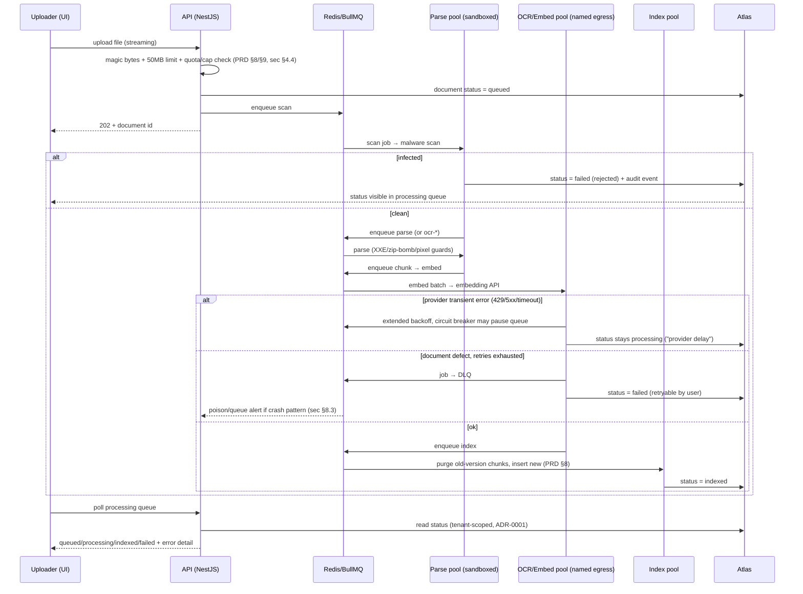

# ADR-0003: Asynchronous Ingestion Pipeline (BullMQ)

**Status:** Accepted (2026-07-10)
**Date:** 2026-07-07
**Deciders:** Product owner (Ehud); drafted in the architecture/ADR pass
**Sources:** PRD §3, §8, §9, §13, §15, §16; sec §3.6, §4.4, §5.6, §6, §8.3; `requirements_review_v01.md` resolution log

## Status

Accepted 2026-07-10 — step-6 consistency review passed; review fixes applied (findings record in the plan). Worker deployment specifics (Cloud Run vs GKE, egress policy mechanics) are ADR-0007's; this ADR fixes the queue topology, stage contracts, and failure semantics.

## Context

BullMQ + Redis workers for ingestion, OCR, and embedding are settled (PRD §16; resolution log). Parsing, chunking, embedding, and indexing must run asynchronously with per-document status (queued / processing / indexed / failed) visible to the uploader, actionable errors, and retryability (PRD §8). The pipeline is also the system's highest-risk attack surface — a malicious document is an attacker (sec §0):

- Malware scan before any parsing (PRD §3; sec §4.4).
- Parsing in a sandboxed worker: container with no network egress except required APIs, low privileges, memory/CPU limits, XXE disabled, zip-bomb guards (compression ratio + entry count), pinned PDF parser, pixel-count limits on images (sec §4.4).
- Embedding/OCR stages call external providers (Vertex AI, Google Vision/Azure) over pinned TLS endpoints, minimal payload (sec §5.6); app egress restricted to named APIs (sec §6).
- OCR branch: user-selected Classic (per page) or Advanced (vision LLM, token-metered), admin-enforceable Classic-only; per-user page quotas rejected **up front** when a document would exceed them (no partial processing); Advanced token caps reject new jobs at the cap while queued jobs complete (PRD §9).
- Repeated parser crashes on one file are a poisoning signal that must alert (sec §8.3).
- Performance: non-OCR document ≤ 50 pages indexed within 10 minutes of upload, p95 (PRD §13); throughput envelope 50,000 OCR pages/month platform-wide (~1,700/day — modest) with 10× headroom not precluded (PRD §13).
- Smart OCR edition runs the same upload → OCR → download processing with per-user isolation, but its files never reach any index (PRD §15; sec §3.6).

Workers carry tenant/user scope in trusted job payloads written by already-scoped enqueue code and rehydrate the CLS scope of ADR-0001, so repository guarantees hold identically inside the pipeline.

## Options Considered

### Option A: One queue, one monolithic job per document

A single `ingest` job performs scan → parse → chunk → embed → index in one worker process.

| Dimension | Assessment |
|-----------|------------|
| Complexity | Lowest — one queue, one processor |
| Security fit | Poor — one process needs both sandbox-grade lockdown (sec §4.4) *and* provider egress (sec §5.6), which are contradictory network postures |
| Retry granularity | Poor — an embedding-API blip re-runs parsing of a 50 MB file |
| Scaling | Coarse — OCR backlog and embed throughput scale together or not at all |

- **Pros:** Trivial to build and reason about; fewest moving parts at MVP volume (PRD §13).
- **Cons:** Cannot satisfy "no egress except required APIs" for the parser while the same process calls Vertex — the sandbox boundary (sec §4.4) is the whole point; retries are wasteful and amplify poison-file blast radius (sec §8.3).

### Option B: Stage-per-queue with BullMQ flows, worker pools split by security posture (chosen)

Queues `scan → parse|ocr-classic|ocr-advanced → chunk → embed → index`, chained as a BullMQ `FlowProducer` tree (or explicit enqueue-next), with three worker deployments: **scan/parse pool** (sandboxed, no internet egress — malware scanning is in-VPC, see Decision), **ocr/embed pool** (egress to named AI/OCR endpoints only), **index pool** (Atlas access only).

| Dimension | Assessment |
|-----------|------------|
| Complexity | Medium — 6 queues, 3 worker deployments, stage contracts |
| Security fit | High — network posture per pool matches sec §4.4/§5.6/§6 exactly |
| Retry granularity | Per stage — an embed failure retries embedding only |
| Scaling | Per stage — OCR concurrency and provider rate limits tuned independently (PRD §9, §13) |

- **Pros:** The sandbox boundary is a deployment boundary, not a code convention; per-stage retries/backoff; per-queue concurrency implements provider rate limiting (sec §5.6) and OCR throughput control; queue depth per stage feeds platform-health dashboards (PRD §5).
- **Cons:** More infrastructure than MVP volume strictly needs; stage handoff contracts to define and version.

### Option C: External workflow orchestrator (e.g., Temporal) over the same stages

- **Pros:** First-class workflow state, replay, and visibility.
- **Cons:** New stateful infrastructure component and operational skill set for a pipeline whose entire MVP volume is ~4,000 documents + 1,700 OCR pages/day (PRD §13); BullMQ is already settled in the stack (PRD §16). Invalidated as over-engineering at this scale; revisit only if pipeline complexity grows past 10× assumptions.

**Decision: Option B.** The differential network posture required by sec §4.4 vs §5.6 is the deciding argument; it is unachievable in Option A and over-bought in Option C.

## Decision

### Stage topology and contracts

```text
upload (API, streaming, magic-byte + 50MB pre-buffer check — sec §4.4, PRD §8)
  └─ scan        malware scan via in-VPC clamd (see below); infected ⇒ reject + audit (PRD §3)
      └─ parse   [sandboxed pool] PDF/DOCX/image extraction (sec §4.4 guards)
      └─ ocr-classic | ocr-advanced   [egress pool] when file is scanned/image or user chose OCR (PRD §9)
          └─ chunk    split to retrieval units, detect lang, page mapping (PRD §2, §10; ADR-0002 schema)
              └─ embed  [egress pool] batch calls to embedding API, minimal payload (sec §5.6; ADR-0008)
                  └─ index  [index pool] purge superseded chunks, insert new, flip status (PRD §8; ADR-0002)
```

Stage handoff: each job carries `{tenantId, userId, documentId, versionId, stage}`; large artifacts (extracted text, chunk sets) pass via object storage under generated keys, never through Redis (keeps Redis small; filenames are untrusted display strings — sec §4.4). Every stage is idempotent keyed on `{versionId, stage}` so at-least-once delivery is safe: index-stage purge-then-insert (ADR-0002) is naturally re-runnable.

### Malware-scan engine: self-hosted ClamAV (in-VPC)

sec §4.4 allowed "ClamAV or cloud scanning API"; this ADR decides **ClamAV**, run as an internal `clamd` service inside the parse pool's network segment (deployment mechanics in ADR-0007), with signature updates (`freshclam`) as the segment's only allowlisted external egress.

- **Why not a cloud scanning API:** it would receive the full bytes of every confidential document — a new sec §9 sub-processor requiring a zero-retention DPA, EU processing, and PPL/2017-regs outsourcing paperwork, purchased to scan ~4,000 documents (PRD §13). Some commercial scan services also share submitted samples, which is disqualifying outright for confidential content (sec §7.1).
- **Accepted trade-off:** ClamAV's detection rate trails commercial engines — acceptable because scanning is one layer of a defense-in-depth pipeline whose real containment is the sandbox itself (sec §4.4 parse guards + ADR-0007 egress rules); signature freshness is monitored (stale-signature alert joins the sec §8.3 catalogue).
- Revisit (recorded in the overview's future-ADR list) only if a compliance customer demands a certified commercial engine.

**Edition/branch gating at enqueue, not in workers:** the Knowledge Base flow enqueues the full chain; the Smart OCR edition flow terminates after `ocr-*` with output written to the user's private directory — the `chunk/embed/index` stages are never enqueued for it, structurally enforcing "never added to any index" (PRD §15). Quota/cap checks run **before** `scan` is enqueued: page quota insufficient ⇒ reject with pages-required vs remaining; Advanced token cap reached ⇒ reject new Advanced jobs, queued ones complete (PRD §9).

### Data Flow

| Role | Actor | Channel |
|------|-------|---------|
| Initiator | API (upload endpoint / OCR submit) after quota+magic-byte checks | HTTP → BullMQ `scan` enqueue (Redis) |
| Processors | scan/parse pool (sandboxed) → ocr/embed pool (named-API egress) → index pool | BullMQ queues per stage; artifacts via object storage |
| Return path | Each stage transition writes `documents.status` / `ocrFiles.status` + stage detail; UI shows the personal processing queue via polling (SSE upgrade optional) (PRD §8, §9) | Worker → MongoDB → API → client |
| Completion signal | Index stage (KB) / OCR stage (Smart OCR) sets `indexed`/`done`; OCR completion email (PRD §6) | Worker → email provider (named egress) |
| Error path | Two classes (see failure taxonomy below): **document defects** retry 3× then DLQ + `documents.status = failed` with actionable, user-safe error (PRD §8); **provider-transient** errors back off with status held at `processing` and a per-queue circuit breaker — never a user-facing failure; repeated crashes on same file ⇒ poison alert to on-call (sec §8.3) | BullMQ DLQ per queue + queue pause/resume + alerting |

### Sequence (round-trip including error path)



### Failure and poison semantics

**Failure taxonomy (added 2026-07-10, design review finding 2).** Every stage error is classified before retry logic runs; the two classes have different owners and different semantics:

- **Document defects** (corrupt/password-protected file, zip bomb, oversized, deterministic parser errors): the *user's* problem. Per-stage exponential backoff (e.g., 5 s base, factor 4, 3 attempts); exhaustion ⇒ DLQ + `status = failed` with an actionable, sanitized error and a retry button (PRD §8). These are the **only** errors that ever surface as a failed document.
- **Provider-transient errors** (HTTP 429/5xx, timeouts, connection resets from embedding/OCR/vision endpoints): the *platform's* problem. The document is **not** failed: the job re-queues with extended backoff in the minutes range (429s honor `Retry-After`), `documents.status` stays `processing` with a "provider delay" stage detail, and the transient-retry budget is counted separately and generously. Rationale: without this split, a 30-minute provider outage converts every in-flight document into a `failed` state requiring manual per-document retries.
- **Circuit breaker per provider-facing queue** (`ocr-*`, `embed`; chat has its own path): a rolling provider-transient error-rate threshold (e.g., ≥ 50% over 2 min) pauses the queue (BullMQ pause), a scheduled canary job probes the provider, and success resumes the queue. Breaker state feeds the PRD §5 provider-status panel and raises a sec §8.3 ops alert. A provider outage thus becomes queue *lag*, visible to operators — not a mass of failed documents.
- Breaker-open and provider-delay time is excluded from poison-pattern detection — crash-pattern alerts count document-defect crashes only — and from the p95 clock as an explicitly reported degradation (PRD §5), since no pipeline design can hide a provider outage inside a latency budget.
- **Poison handling:** after final failure the job lands in the stage's DLQ with the sanitized error; `attemptsMade ≥ 3` on the same `{documentId}` across re-submissions raises the sec §8.3 "queue poisoning" alert. DLQ jobs are inspectable by platform operators (PRD §5 platform health) but replayed only deliberately.
- **User-facing errors are actionable and sanitized:** parser internals never surface (log hygiene, sec §8.2); the user sees categorized causes — corrupt/password-protected file (PRD §8), quota exceeded (PRD §9) — with a retry button; provider delays are shown as "still processing," never as user-actionable failures (taxonomy above).
- **Timeouts:** per-stage job timeouts (parse 5 min, OCR 15 min/50 pages, embed 5 min) keep a stuck job from silently eating the p95 budget; timeout counts as a retryable failure.

### Meeting the p95 ≤ 10 min target (PRD §13)

Worst non-OCR path = scan + parse + chunk + embed + index. Dominant term is embedding: ≤ 50 pages ≈ ≤ 150 chunks; batched at 32 chunks/request, ~5–10 requests — seconds, not minutes, at documented provider rates (ADR-0008). Budget allocation: queue wait ≤ 5 min (alarm threshold on queue age feeds PRD §5 platform health), processing ≤ 5 min. At MVP volume (~4,000 docs total, PRD §13) a concurrency of 2–4 per pool clears this with an order of magnitude to spare; pools scale horizontally per queue for 10×.

### Metering

`ocr-*` and `embed` stages emit `usageEvents` (files, pages, tokens per user/tenant — PRD §9, §15) transactionally with job completion, so billing data exists from day one (PRD §5) and survives Smart-OCR file expiry (PRD §15).

## Consequences

- **Positive:** Security postures are physically separated per pool (sec §4.4/§5.6/§6); per-stage retries make provider flakiness cheap; queue metrics map 1:1 to the platform-health dashboard (PRD §5); Smart OCR edition reuses the identical pipeline minus enqueued stages (PRD §15) — one codebase, no divergent OCR path.
- **Negative / accepted risks:** Six queues and three worker deployments is real infrastructure for MVP volume — accepted as the cost of the sandbox boundary; stage contracts (artifact keys, status transitions) must be versioned when the pipeline evolves. Redis becomes availability-critical for ingestion (not for chat/search reads); mitigation is a **dedicated managed queue instance** (`redis-queue`, `noeviction` + headroom alert) split from the sessions instance so queue pressure and auth never share a failure domain (ADR-0007; design review 2026-07-10, finding 1).
- **Follow-ups:** ADR-0007 fixes worker runtime (Cloud Run/GKE), egress policy mechanics, and the dedicated `redis-queue` (Memorystore) sizing; ADR-0008 fixes embedding batch limits and provider rate limits feeding the p95 budget; implementation-phase tests include a poison-file corpus (zip bomb, XXE fixture, decompression bomb) exercising the sec §4.4 guards, and an idempotency test re-running each stage.
