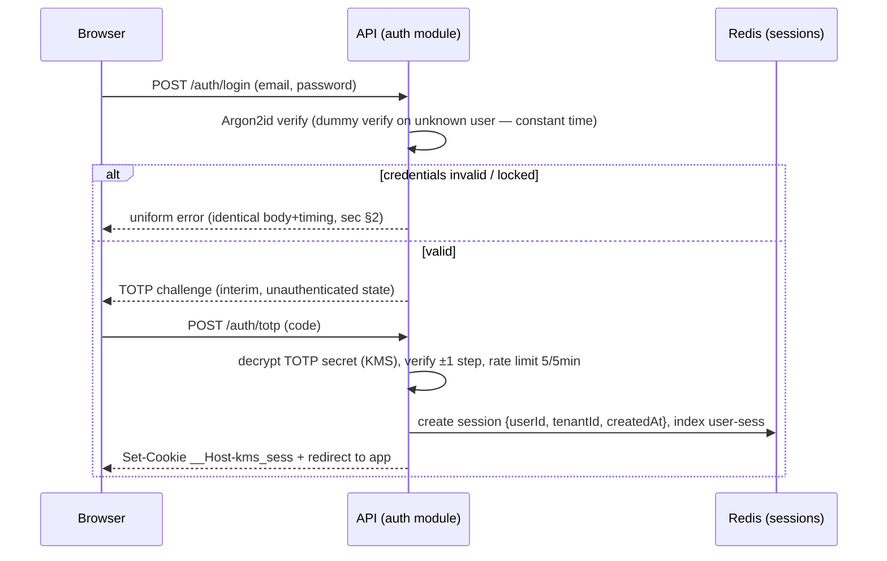

# ADR-0004: Authentication, Sessions, and the Platform-Admin Realm

**Status:** Accepted (2026-07-10)
**Date:** 2026-07-10
**Deciders:** Product owner (Ehud); drafted in the architecture/ADR pass
**Sources:** PRD §3, §5, §6, §13; sec §2, §3.5, §7.2, §8.3; `requirements_review_v01.md` resolution log (MFA row)

## Status

Accepted 2026-07-10 — step-6 consistency review passed; review fixes applied (findings record in the plan) of the full ADR set.

## Context

Identity is internal — the system manages its own user directory, no corporate IdP in MVP (PRD §6; resolution log). The security spec fixes most of the mechanism space already:

- Server-side sessions referenced by httpOnly/Secure/SameSite=Lax cookies; explicitly **not** JWT-in-localStorage (sec §2) — XSS must not yield a stealable token.
- Idle timeout 30 min, absolute lifetime 12 h, both configurable (PRD §3); rotation on login/privilege change; immediate revocation on logout, deactivation, and password change (sec §2; PRD §6 "deactivation immediately revokes all active sessions").
- Argon2id password hashing (memory ≥ 64 MB, time ≥ 3), per-user salt + global pepper in the secrets manager (sec §2).
- TOTP mandatory for all logins, ±1 step, rate-limited 5/5 min; 10 single-use backup codes hashed like passwords; TOTP secrets field-level encrypted (sec §2, §7.2); SMS deferred (resolution log).
- Enumeration resistance (identical error + timing), progressive delays, lockout with admin unlock, CAPTCHA after repeated failures (sec §2; PRD §3).
- Platform-admin portal: **separate auth realm** — distinct cookie name/domain, distinct user store, TOTP mandatory, idle 15 min (sec §2; PRD §5).

The open decisions are therefore: (1) where the session store lives, and (2) how "separate realm" is realized in code and deployment. Scale is trivial for any option (8,000 users, PRD §13); the drivers are revocation semantics and blast-radius separation.

## Options Considered

### Option A: Redis (Memorystore) session store (chosen)

Sessions as Redis hashes `sess:{realm}:{sessionId}` with TTL = remaining idle window; a per-user set `user-sess:{userId}` indexes active sessions for mass revocation.

| Dimension | Assessment |
|-----------|------------|
| Complexity | Low — Redis is already in the stack for BullMQ (PRD §16) |
| Revocation | O(1) delete; mass revocation via the per-user index — satisfies "immediately revokes" (PRD §6) |
| Latency | Sub-ms lookup on every request — fits p95 budgets (PRD §13) |
| Failure mode | Redis outage ⇒ nobody can authenticate (fail closed — acceptable). Sessions live on the dedicated `redis-app` instance (ADR-0007) — a BullMQ/ingestion burst on `redis-queue` cannot pressure or evict sessions (design review 2026-07-10, finding 1) |

- **Pros:** Native TTLs implement idle expiry without a sweeper; one infra dependency reused; session data is ephemeral by classification (no backup complexity).
- **Cons:** Sessions don't survive a Redis flush — users re-login (accepted: rare, and re-auth is cheap); absolute-lifetime enforcement needs an explicit `createdAt` check in the guard, TTL alone can't express two clocks.

### Option B: MongoDB session collection

Sessions in Atlas with a TTL index.

- **Pros:** One fewer critical use of Redis; sessions survive Redis maintenance.
- **Cons:** TTL-index deletion runs ~every 60 s — expired sessions linger, so the guard must re-check timestamps anyway; adds session churn writes to the primary data cluster; slower than Redis for a per-request hot path. No advantage that outweighs reusing Redis.

### Option C: Stateless JWT

Invalidated by sec §2 (no token in a place XSS can reach; immediate revocation is required and JWTs cannot be revoked without a server-side denylist — which *is* a session store). Recorded only to show it was considered.

**Decision: Option A.**

## Decision

### Session mechanics

- Cookie: `__Host-kms_sess` (tenant realm) — httpOnly, Secure, SameSite=Lax, path=/ (sec §2; `__Host-` prefix pins origin). Value: 128-bit random session id; no data in the cookie.
- Redis record: `{userId, tenantId, role, createdAt, lastSeenAt, mfaVerified}`. Guard enforces **both** clocks: `now − lastSeenAt ≤ idle (30 min)` and `now − createdAt ≤ absolute (12 h)` (PRD §3); values per-tenant configurable with these defaults.
- Rotation: new session id issued on login and on any privilege change (sec §2); old id deleted atomically.
- Revocation: logout deletes the session; deactivation and password change iterate `user-sess:{userId}` and delete all (PRD §6; sec §2). The auth guard is the *only* reader; it populates the CLS scope of ADR-0001.
- ToS/Privacy gate: `session.tosVersion` checked against the current version; mismatch forces the acceptance interstitial before any API access (PRD §6).

### Credential storage

- Argon2id: memory 64 MiB, time 3, parallelism 1 **[floor per sec §2 — revisit against OWASP guidance at each annual review, audit plan §4 item 9]**; per-user salt; global pepper from Secret Manager (ADR-0007), applied as HMAC pre-hash so pepper rotation re-wraps without user resets.
- Password policy: min 12 chars, no composition rules, breach-list check via haveibeenpwned k-anonymity, identifier-in-password rejection (sec §2).
- TOTP secrets and backup codes: envelope-encrypted per field with a KMS data key (sec §7.2; ADR-0007), decrypted only inside the auth module; backup codes stored Argon2id-hashed, single-use (sec §2).
- Password reset: 128-bit single-use token, SHA-256-hashed in DB, ≤ 30 min expiry; all sessions invalidated on reset; notification email on password/MFA changes (sec §2).

### Login hardening

Unknown-user and wrong-password paths execute the same work (dummy Argon2id verify against a fixed hash) and return identical bodies — the timing property is CI-asserted (test plan §3.2). Progressive delay after 3 failures, lockout after 10 with admin unlock (PRD §3), CAPTCHA from the 5th failure; the same discipline applies to reset and CSV-import flows (sec §2). Failed-login bursts and lockout waves alert per sec §8.3.

### Platform-admin realm: separate app, separate store

The portal is a **separate NestJS application** (`apps/portal-api`, ADR-0009 naming) with its own user collection (`platformAdmins`), its own cookie (`__Host-kms_padm` — the `__Host-` prefix forbids a `Domain` attribute by design, so realm separation rests on distinct cookie *name* + distinct *hostname* (`admin.…`), each cookie pinned to its own host), its own Redis session prefix, idle 15 min, TOTP mandatory with no backup-code self-reset (a second platform admin must reset — two-person control), and optional IP allowlist (sec §2). It shares the auth *library* (Argon2id/TOTP code) but no session namespace and no user store — a tenant cookie is structurally meaningless on portal routes and vice versa (test plan §3.2 asserts this). Portal actions run under `SystemScope.run(reason, …)` (ADR-0001) so every cross-tenant read is audited (PRD §5, §12).

The admin **UI** is *not* a separate frontend app: the single Next.js `apps/web` serves the portal screens on the `admin.…` hostname (design review 2026-07-10, finding 8). This costs nothing security-wise — the frontend holds no data or trust; every byte flows through `portal-api` under the realm rules above, and the `__Host-` cookie is pinned to the admin hostname regardless of which build serves the HTML — while removing a fifth app to build, deploy, and patch.

### Data Flow (login round-trip)

| Role | Actor | Channel |
|------|-------|---------|
| Initiator | Browser (login form) | HTTPS POST |
| Processor | API auth module → Argon2id verify → TOTP challenge → session create | In-process + Redis |
| Return path | Set-Cookie (httpOnly session id) + redirect | HTTPS response |
| Error path | Uniform failure response; counters in Redis drive delay/lockout/CAPTCHA; sec §8.3 alerts | Redis counters → alerting |

## Consequences

- **Positive:** Revocation semantics exactly match PRD §6/sec §2 with no denylist machinery; the realm split makes tenant→platform privilege escalation a network/codebase boundary, not a role check; auth code is one shared library with two thin realm bindings.
- **Negative / accepted risks:** Redis becomes auth-critical — mitigated by managed Memorystore HA on a **dedicated `redis-app` instance**, isolated from the BullMQ queue instance so ingestion load cannot evict sessions (ADR-0007; design review 2026-07-10); running a second backend app for ~a handful of operators is real overhead, accepted for the sec §2 realm requirement (its UI folds into the shared web app, see above); Argon2id at 64 MiB×3 costs ~100–200 ms per login — irrelevant at MVP login rates (PRD §13) and a feature against credential stuffing.
- **Follow-ups:** ADR-0007 provisions Memorystore HA + Secret Manager/KMS; test plan §3.2 timing/lockout/session assertions; portal IP-allowlist decision at first production deploy; annual Argon2id parameter review (audit plan §4 item 9).
