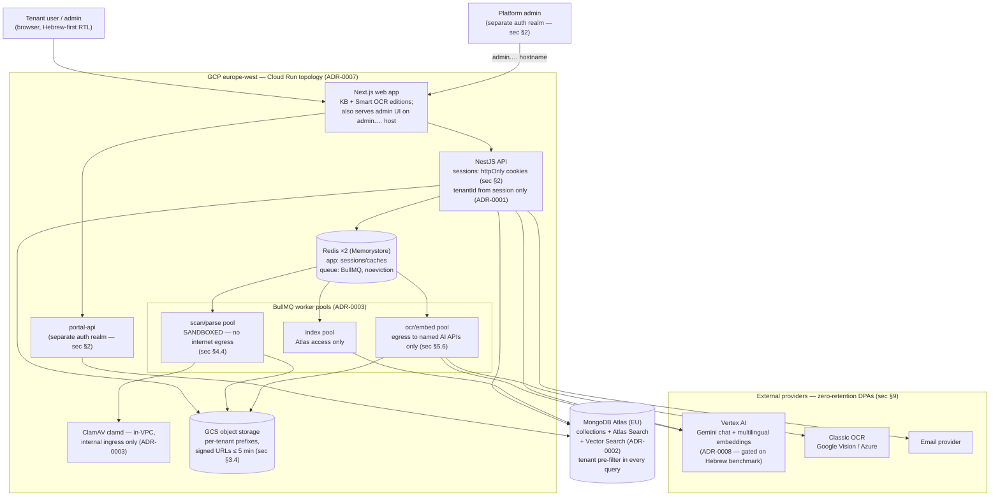
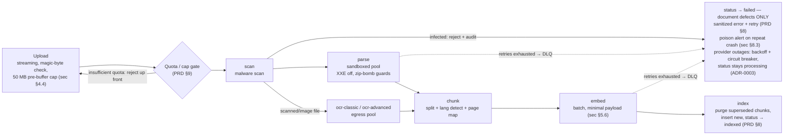
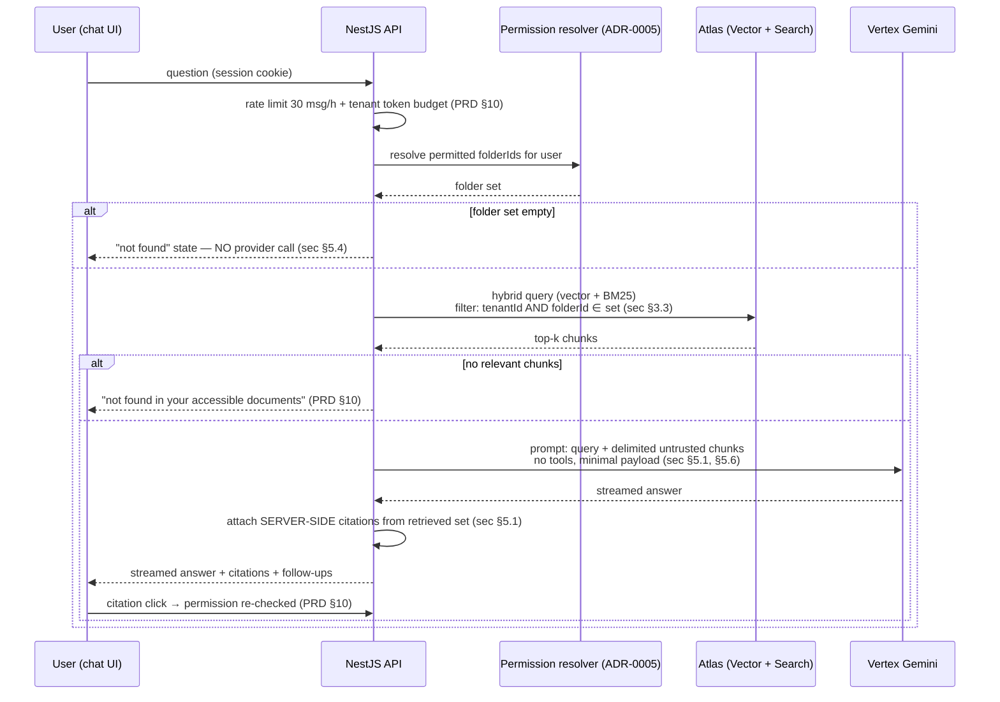
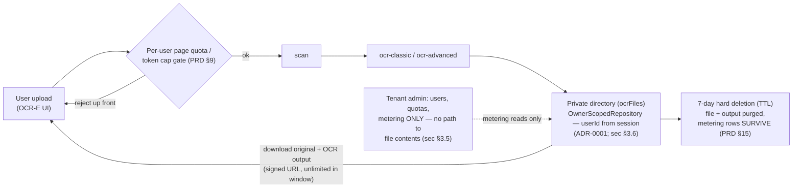

# System Architecture Overview

Date: 2026-07-10 (v3; v2 2026-07-10, v1 2026-07-08) · Status: FINAL for the ADR pass — all nine ADRs **Accepted** after the step-6 consistency review (findings + fixes recorded in the plan); ADR-0008 is Accepted-gated: its provider choice finalizes only when the Hebrew benchmark passes. A design-quality review ran 2026-07-10 (record: [design-review-2026-07-10.md](design-review-2026-07-10.md)); findings 1, 2, and 8 are applied to the ADRs and reflected here, finding 9 is planned as ADR-0010, the rest are recorded with triggers.
Sources: `docs/requirements_v02.md` (PRD), `docs/security_requirements_v01.md` (sec), `docs/adr/0001..0009`, `docs/plans/architecture-adr-pass-07-07-2026-plan.md`

## 1. Container view

One GCP project, europe-west region (PRD §3 EU residency). Three worker pools exist because their network postures are mutually exclusive (ADR-0003): the parse sandbox may not reach the internet, the OCR/embed pool may reach only named AI endpoints, the index pool reaches only Atlas.

Key invariants visible at this level:

- No client ever talks to Atlas, GCS (except via signed URL), Redis, or a provider directly.
- `tenantId` enters every data path from the session via the scoped-repository layer (ADR-0001); workers rehydrate the same scope from trusted job payloads (ADR-0003).
- The platform-admin portal is a separate realm — separate backend app (`portal-api`), user store, and cookie, mandatory TOTP, 15-min idle (sec §2; ADR-0004); its UI is served by the shared web app on the admin hostname (design review finding 8 — the frontend holds no trust).
- Sessions and the job queue live on **separate Redis instances** with opposite eviction policies — an ingestion burst can never evict logins, and BullMQ never runs under an eviction policy that loses jobs (ADR-0007; design review finding 1).
- Provider outages surface as queue lag ("provider delay", circuit breaker), never as failed documents — only document defects fail a document (ADR-0003; design review finding 2).

## 2. Ingestion data flow (Knowledge Base edition)

Stage-per-queue topology; quota and validation gates run *before* anything is enqueued (ADR-0003). Full sequence diagram with the error path lives in ADR-0003.

- Handoff artifacts (extracted text, chunk sets) travel via GCS under generated keys, never through Redis (ADR-0003).
- Every stage is idempotent on `{versionId, stage}`; index purge-then-insert makes re-runs safe and enforces latest-version-only indexing (ADR-0002; PRD §8).
- Target: ≤ 50-page non-OCR document indexed within 10 min p95 (PRD §13).

## 3. Chat / retrieval data flow

The retrieval pre-filter (tenant + permitted folders) lives *inside* the Atlas query — never applied after results return (sec §3.3; ADR-0002). Grounding is fail-closed: no retrieved chunks ⇒ no provider call (sec §5.4).

- The renderer accepts text formatting only — no images/HTML/remote loads (sec §5.2); this is defense-in-depth against exfiltration-via-markdown independent of model behavior.
- Standalone hybrid search (PRD §10) reuses the same pre-filtered query builder — one audited function constructs all retrieval queries (ADR-0002).

## 4. Smart OCR standalone edition flow

Same pipeline mechanics, different scope key and a structurally shorter chain: `chunk/embed/index` are never enqueued, so OCR-E content can never reach an index (PRD §15; ADR-0003).

## 5. Traceability — sec §12 MVP acceptance checklist → architecture

| # | sec §12 item | Where decided |
|---|---|---|
| 1 | Repository-layer tenant enforcement + cross-tenant CI suite | ADR-0001; test plan §3.1 |
| 2 | Argon2id, encrypted TOTP secrets, server-side sessions, enumeration resistance | ADR-0004; test plan §3.2 |
| 3 | Signed URLs, magic-byte validation, malware scan, sandboxed parsing | ADR-0003 (scan/sandbox); ADR-0006 (upload validation, signed URLs) |
| 4 | Pre-filtered retrieval, server-side citations, locked-down renderer | ADR-0002 (query shape); ADR-0005 (permission set); ADR-0008 (prompt/citations); UI spec §3.5 (renderer) |
| 5 | Rate limits + token budgets on all AI surfaces | ADR-0003 (enqueue-time gates); ADR-0008 (cost controls); test plan §4.10 |
| 6 | Security headers, WAF, private DB endpoint, secrets management | ADR-0007 (Cloud Armor, Atlas PSC, Secret Manager/KMS) |
| 7 | Append-only audit, ≥ 24-month retention, alerting | ADR-0002 (`auditEvents`); ADR-0006 (WORM export bucket); ADR-0007 (sec §8.3 alert policies) |
| 8 | Deletion verification, PPA runbook, sub-processor DPAs | ADR-0006 (verification jobs, certificates); DPAs = process (sec §9; audit plan §4 item 10); PPA runbook = pre-GA process item |
| 9 | CI security gates + scheduled pentest | ADR-0009 (CI mapping); test plan §2; `docs/security_audit_plan_v01.md` |

## 6. ADR index

| ADR | Status |
|---|---|
| [0001 — Tenant scoping at the Mongoose layer](../adr/0001-tenant-scoping-mongoose.md) | Accepted |
| [0002 — Atlas data model & search/vector index design](../adr/0002-atlas-data-and-index-design.md) | Accepted |
| [0003 — Ingestion pipeline (BullMQ)](../adr/0003-ingestion-pipeline.md) | Accepted |
| [0004 — AuthN, sessions & platform-admin realm](../adr/0004-authn-and-sessions.md) | Accepted |
| [0005 — RBAC folder permissions & resolution](../adr/0005-rbac-folder-permissions.md) | Accepted |
| [0006 — File storage & serving (GCS)](../adr/0006-file-storage-and-serving.md) | Accepted |
| [0007 — Hosting topology (GCP / Cloud Run)](../adr/0007-hosting-topology-gcp.md) | Accepted |
| [0008 — LLM/embedding providers + Hebrew benchmark gate](../adr/0008-llm-embedding-providers.md) | Accepted (gated on Hebrew benchmark) |
| [0009 — Repo layout & edition gating](../adr/0009-repo-layout-and-edition-gating.md) | Accepted |
| [0010 — Schema migrations & data backfills](../adr/0010-schema-migrations-and-backfills.md) | Accepted (written without a live-cluster tooling spike — see its Status section) |
| [0012 — Module entitlement mechanism](../adr/0012-module-entitlement.md) | Accepted |

Future-ADR candidates (recorded, not opened; triggers in the [design-review record](design-review-2026-07-10.md) where noted):

- Transactional email provider selection (design review finding 11) — needed before implementing password reset / OCR-completion emails; small decision, EU processing + DPA check.
- Worker-pool consolidation: merge the index pool into the ai pool (design review finding 3) — revisit when writing the first Terraform worker modules.
- Direct-to-GCS resumable uploads if API-streamed upload throughput becomes a measured bottleneck (ADR-0006; design review finding 12 flags the threshold for validation with real traffic).
- Grant-group tokens on chunks if folder counts exceed the ADR-0005 cardinality bound (~2,000 folders/tenant).
- Server-side Atlas `$rankFusion` replacing application-side RRF (ADR-0002).
- GKE migration if a workload needs NetworkPolicy-grade egress control or > 60-min jobs (ADR-0007).
- Commercial malware-scan engine replacing ClamAV if a compliance customer demands one (ADR-0003); clamd-as-sidecar packaging is a Terraform-time detail (design review finding 10).
